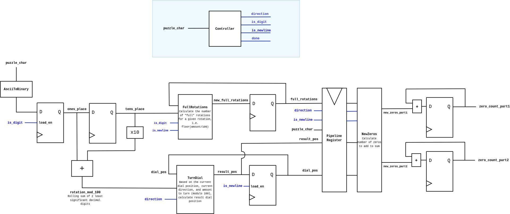

# Day 1 Part 1
Read the input one character at a time. Keep track of the current direction and
update it when an 'L' or 'R' is encountered.
As digits are read, keep track of only the two most recent (least significant)
decimal digits since the dial rotation is modulo 100. When a newline is 
reached, calculate the dial's new position and check whether or not it landed 
on zero.

# Day 1 Part 2
Add some logic to account for passing zero but not landing on it.

Add `floor(rotation amount / 100)` for (potentially multiple) 100 tick rotations.
Add 1 if `rotation % 100` passes zero.

# Results / Performance
For Part 1, the design processes one character per clock cycle.
It achieved timing closure at 100MHz for my FPGA, so for the puzzle input size
of 19,623 characters (including end-of-puzzle indicator char), 
it generated a result in 196.23 microseconds.

For Part 2, the additional logic in the design initially didn't meet timing, 
so I just added a pipeline register before calculating the amount of zeros
encountered per rotation. This required one additional clock cycle, for a
total time of 196.24 microseconds.
