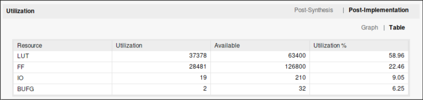
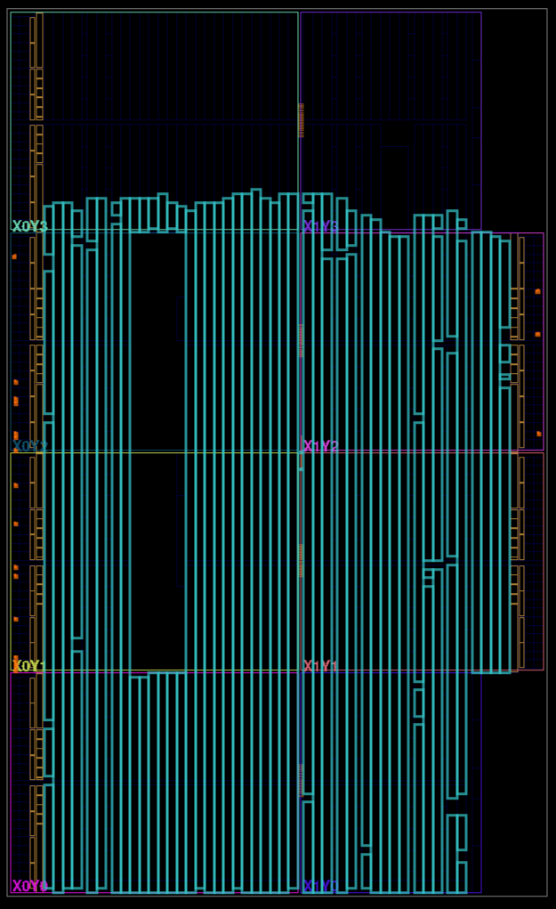

# Day 10
_Note: if you'd like to test the full input for this day, edit the number of
solvers specified on line 8 of `solution.ml` from 3 to 166. This is explained 
later._

## Solution (Part 1)
A few things come to mind when reading this problem. Firstly, pressing a 
button and toggling the lights is equivalent to XORing the current state of 
the indicator lights with a mask where each bit is `1` if that light is 
included in the button and `0` otherwise.

Additionally, 
- The order of button presses doesn't matter. XOR is commutative
- Pressing a button twice is equivalent to not pressing it at all. Or, more
generally, an even number of presses has no effect and an odd number of presses
is equivalent to a single press. (X ^ Y ^ Y = X)

Since each button should only be pressed 0 or 1 times and order doesn't matter,
There are 2^B possible ways to press the buttons for B available buttons. Counting
up, in binary, up to 2^B - 1 covers all permutations worth checking.

A peek at the puzzle input shows that the maximum number
of buttons for a given line is 13. 2^13 is only 8192, so enumerating over all of
them is feasible.

### A Potential Solution
At this point one might arrive at the following solution:

For each machine...
1. Count up from 0 to 8191
2. For each '1' bit in the counter, include that button in an XOR operation between
all buttons to press
3. Are the indicator lights correct? If so, do a popcount of the counter, compare 
that to the current minimum number of button presses for that machine, and 
update it if a new minimum was found.

In hardware, this would translate to an XOR tree with 13 inputs (4 layers). Each
of the input is either: the button mask if that button is selected, or all zeros 
since X ^ 0 = X (no effect).

This works, but is there a way to get rid of that XOR tree? And without increasing
the overall latency of the solver?

### A Better Solution
There are three goals here:
- Properly enumerate over every possible combination of pressed buttons
- Limit the depth of the XOR logic on each cycle
- Keep the latency within 2^B cycles ( ~8192 for the full puzzle input )

If only there was a way to visit every subset of buttons while only altering the
selection of one button at a time between subsets...

Fortune is upon us. Using Gray codes solves our problems :-)

Initialize a B-bit counter, where B is the maximum number of buttons per machine.
Increment this counter once per cycle, like last time, but keep track of the Gray 
code at each step.

At each step between two permutations, only ONE button is switched on/off.
Which button? The XOR of two adjacent Gray codes yields a onehot value where the
'1' is at the location of the toggle.

This is exactly which button should be toggled on this cycle. So do
`acc = acc ^ Buttons[toggle idx]`

At this point, check if the accumulator matches the desired light pattern.
If so, do a population count of the current Gray code and compare it to the current
minimum presses found so far. Replace the minimum if appropriate.

Marevelous! Instead of XORing 13 inputs in one cycle, only 2 values are XORed:
the accumulator and one button. This saves on routing, LUTs, and propagation 
delay. And it still only takes 2^B cycles per machine to find
the result.

So we have a solver for a single machine. What now? Design a job dispatcher
and assign parsed inputs to any that are on standby? Sure, or just instantiate
exactly 166 of them. One for each machine. There shall always be exactly 166
machines.

## Performance / Area
The overall runtime is dominated by UART I/O. Once the entire input has streamed 
into the FPGA, processing takes an additional ~8200 cycles. This design meets 
timing at 100MHz, so the latency of each machine solver is ~82 microseconds.

Some stats:

Huge fan of the wavy shape Vivado went for with the schematic:

I paid for all the LUTs, I'm gonna use all the LUTs (all = 58.96%)

## Potential Improvements
Yeah okay it's a little silly to have a dedicated machine solver for each line
of the input. A more realistic solution would include a FIFO on the output of the
parser and a dispatcher to deliver the parsed line to a solver once one becomes
available.
